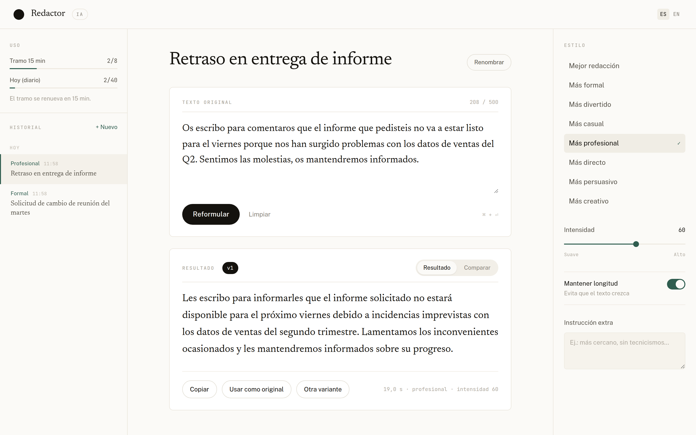

# Redactor IA

Herramienta web para reformular y mejorar textos usando inteligencia artificial. El usuario pega su texto, elige el tono deseado y recibe una versión reescrita por un modelo LLM en segundos.

---

## Preview



---

## Para qué sirve

- **Mejorar la redacción** de textos escritos rápido o con errores de estilo
- **Cambiar el tono** de un mensaje: más formal, casual, profesional, directo, persuasivo, divertido o creativo
- **Ajustar la intensidad** del cambio (desde leve retoque hasta reescritura total)
- **Mantener o liberar la longitud** del texto original según necesidad
- **Agregar instrucciones extra** para personalizar el resultado
- **Nombrar el documento automáticamente** a partir del texto, con la propia IA
- **Generar varias variantes** del mismo texto y alternar entre ellas
- **Comparar** el original y el resultado palabra por palabra
- **Recuperar textos anteriores** desde el historial (guardado en el navegador)

---

## Tecnologías

### Frontend

| Tecnología | Uso |
|---|---|
| **React 19** | Framework UI principal |
| **Vite** | Bundler y servidor de desarrollo |
| **CSS propio** | Sistema de diseño con custom properties (sin framework de utilidades) |
| **i18next** | Internacionalización (español / inglés) |
| **localStorage** | Historial de documentos, sin backend de persistencia |

Tipografías: **Public Sans** (interfaz), **Newsreader** (texto redactado) y **JetBrains Mono** (metadatos y contadores).

### Backend

| Tecnología | Uso |
|---|---|
| **Node.js + Express 5** | Servidor HTTP y API REST |
| **API compatible con OpenAI** | Interfaz única con la IA: el modelo se elige en el `.env` |
| **Gemini** | Proveedor por defecto (reformula el texto y nombra el documento) |
| **LiteLLM** | Proxy opcional para repartir entre varios modelos o proveedores |
| **Helmet** | Headers de seguridad HTTP |
| **CORS** | Control de acceso entre origen frontend y backend |
| **express-rate-limit** | Límite de uso por IP (8 intentos/15min, 40/día) |
| **dotenv** | Gestión de variables de entorno |

---

## Arquitectura

```
redactor-ia/
├── frontend/          # App React (Vite)
│   └── src/
│       ├── components/    # AppHeader, HistoryRail, DocumentHeader,
│       │                  # SourceSection, ResultSection, DiffView, StyleRail
│       ├── pages/         # Home.jsx (estado del documento en edición)
│       ├── hooks/         # useDocuments (historial), useCountdown (reinicio del tramo)
│       ├── utils/         # diffWords (comparación), documents (títulos y agrupación)
│       ├── services/      # Llamadas a la API del backend
│       ├── locales/       # Traducciones es.json / en.json
│       ├── constants/     # Tonos, límites, valores por defecto
│       └── index.css      # Tokens de diseño y estilos de toda la interfaz
└── backend/           # API Express (Node.js)
    └── src/
        ├── routes/        # POST /api/rewrite, GET /api/limits
        ├── controllers/   # Lógica de las rutas
        ├── services/      # Cliente de IA (cualquier API compatible con OpenAI)
        ├── middlewares/   # Rate limiting, manejo de errores
        └── utils/         # Construcción del prompt
```

### Cómo se organiza la interfaz

La pantalla es un único espacio de trabajo de tres columnas:

- **Izquierda — Historial.** Cada texto reformulado se guarda como documento, agrupado por día. Solo se guardan los que tienen al menos un resultado, y se conservan los 40 más recientes. Por debajo de 1280 px pasa a ser un cajón lateral.
- **Centro — Documento.** Título, texto original con contador de caracteres y el resultado. El nombre lo propone la IA en la primera reformulación de cada documento —una sola vez, no en las siguientes variantes— y siempre se puede cambiar a mano. Mientras se escribe, antes de esa primera llamada, se deriva de la primera frase del texto. Las sucesivas generaciones del mismo documento se acumulan como versiones (`v1`, `v2`…) y la pestaña *Comparar* enfrenta el original con el resultado marcando lo eliminado y lo añadido.
- **Derecha — Estilo.** Tono, intensidad, longitud, instrucción extra y consumo de intentos con el tiempo que falta para recuperar el tramo.

Atajo: `⌘/Ctrl + Enter` reformula sin salir del área de texto.

---

## Configuración y arranque

### 1. Variables de entorno

Crea un archivo `.env` en la carpeta `backend/`:

Copia `backend/.env.example` a `backend/.env` y rellena la clave:

```bash
cp backend/.env.example backend/.env
```

Obtén tu API key gratis en: https://aistudio.google.com/apikey

### Cambiar de modelo de IA

El backend no habla con ningún proveedor en concreto: usa el formato de la API
de OpenAI y toma del `.env` a dónde apunta, con qué clave y con qué modelo.
**Cambiar de modelo es editar una línea y reiniciar; no se toca código.**

```env
AI_BASE_URL=https://generativelanguage.googleapis.com/v1beta/openai
AI_MODEL=gemini-3.5-flash
```

Los tres modelos preparados, de más rápido a más capaz:

| `AI_MODEL` | Cuándo usarlo |
|---|---|
| `gemini-flash-lite-latest` | Prima la latencia |
| `gemini-3.5-flash` | Equilibrado (por defecto) |
| `gemini-3.6-flash` | Prima la calidad |

`AI_REASONING_EFFORT` controla cuánto puede razonar el modelo antes de
responder. Conviene dejarlo en `low`: con valores altos, el razonamiento se
come el presupuesto de tokens y las respuestas llegan cortadas a media frase.

### Varios modelos a la vez, con LiteLLM (opcional)

El plan gratuito de Gemini da **20 peticiones al día y por modelo**, muy por
debajo de los límites que anuncia la aplicación. LiteLLM levanta un proxy que
reparte entre los tres modelos y reintenta con otro cuando uno agota su cuota,
además de permitir mezclar proveedores distintos.

```bash
docker compose up -d                                  # arranca el proxy en :4000
curl http://localhost:4000/health/liveliness          # comprobar que responde
```

Después, en `backend/.env`, apunta el backend al proxy y usa uno de los alias
declarados en `litellm_config.yaml` (`rapido`, `equilibrado` o `calidad`):

```env
AI_BASE_URL=http://localhost:4000/v1
AI_MODEL=equilibrado
AI_API_KEY=sk-local-redactor-ia
```

### 2. Instalar dependencias

```bash
npm install --prefix backend
npm install --prefix frontend
```

### 3. Levantar el proyecto

```bash
# Desde la raíz del proyecto
node backend/src/server.js & npm run dev --prefix frontend
```

- Frontend: http://localhost:5173/redactor-ia/
- Backend: http://localhost:3001
- Health check: http://localhost:3001/health

### 4. Parar los servicios

```bash
pkill -f "node.*server.js" && pkill -f "vite"
```

---

## Pruebas

```bash
npm test --prefix backend     # lógica del backend (37 pruebas)
npm test --prefix frontend    # utilidades del frontend (18 pruebas)
node e2e/run.mjs              # de principio a fin, en un navegador real
```

Las dos primeras usan el runner que trae Node, sin dependencias añadidas, y
cubren lo que más fácil se rompe en silencio: la validación de entrada, la
limpieza del título que devuelve la IA, la traducción de errores del proveedor
y la comparación palabra a palabra.

La prueba de principio a fin arranca el backend y el frontend en puertos
propios, abre un navegador y recorre el flujo completo: escribir, reformular
con atajo de teclado, copiar, generar variantes, comparar, renombrar,
historial, persistencia al recargar, límite de caracteres, los dos idiomas,
límite agotado, caída de red y el cajón del historial en móvil.

```bash
node e2e/run.mjs --sin-ia     # sin gastar cuota: simula las respuestas de la IA
```

Necesita un Chromium; lo busca en el caché de Playwright, en el sistema o en
la variable `CHROME_PATH`.

---

## Limites de uso

Para evitar abuso de la API de IA, el backend aplica rate limiting por IP:

- **8 intentos** por ventana de 15 minutos
- **40 intentos** por día (reset a medianoche)
- Máximo **500 caracteres** por texto de entrada

El frontend sincroniza estos contadores con `GET /api/limits` al cargar y con la respuesta de cada reformulación, así que lo que se muestra en pantalla siempre viene del servidor.
