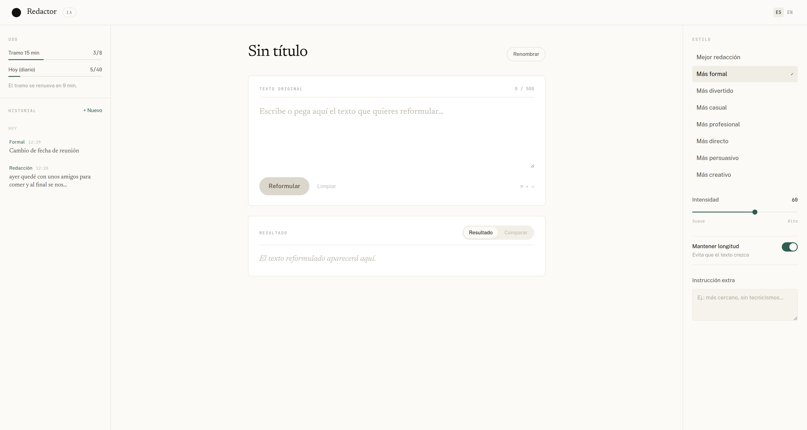

# Redactor IA

Aplicación web para reformular textos con inteligencia artificial. Pegas un texto, eliges el tono y recibes una versión reescrita, con la posibilidad de comparar ambas palabra por palabra y de guardar cada documento en un historial.



---

## Qué hace

- **Reformula** el texto en ocho tonos: mejor redacción, formal, divertido, casual, profesional, directo, persuasivo y creativo.
- **Gradúa el cambio** con un control de intensidad, y puede **limitar la longitud** para que el texto no crezca.
- **Acepta una instrucción libre** («más cercano, sin tecnicismos…») que se suma al tono.
- **Nombra el documento** con la propia IA, una sola vez por documento, y el nombre se puede cambiar a mano.
- **Acumula variantes** del mismo texto (`v1`, `v2`…) para poder volver a cualquiera.
- **Compara** el original y el resultado marcando lo eliminado y lo añadido.
- **Guarda un historial** por días, en el navegador, con los 40 documentos más recientes.
- **Habla español e inglés**, y se adapta de escritorio a móvil.

### Cómo se organiza la interfaz

Un espacio de trabajo de tres columnas:

- **Izquierda.** Consumo de intentos con el tiempo que falta para recuperarlos, y debajo el historial agrupado por día. Solo se guardan los documentos que tienen algún resultado. Por debajo de 1280 px pasa a ser un cajón lateral.
- **Centro.** El documento: su nombre, el texto original con contador de caracteres y el resultado. Mientras se escribe, el nombre se deriva de la primera frase; en la primera reformulación lo sustituye el que propone la IA. Las siguientes generaciones se acumulan como versiones, y la pestaña *Comparar* enfrenta original y resultado.
- **Derecha.** Tono, intensidad, longitud e instrucción extra.

Atajo: `⌘/Ctrl + Enter` reformula sin salir del área de texto.

---

## Puesta en marcha

Necesitas **Node.js 20 o superior** y una clave de [Google AI Studio](https://aistudio.google.com/apikey), que es gratuita.

```bash
# 1. Dependencias
npm install --prefix backend
npm install --prefix frontend

# 2. Configuración
cp backend/.env.example backend/.env    # y rellena GEMINI_API_KEY

# 3. Arrancar
node backend/src/server.js & npm run dev --prefix frontend
```

La aplicación queda en **http://localhost:5173/redactor-ia/** — con la barra final: `/redactor-ia/` es la ruta base configurada en Vite, y sin ella Vite devuelve un 404.

Para parar:

```bash
pkill -f "node.*server.js" && pkill -f vite
```

El frontend llama a `http://localhost:3001` salvo que se le diga otra cosa. Para apuntar a otro backend al construir:

```bash
VITE_API_URL=https://api.tu-dominio.com npm run build --prefix frontend
```

---

## Elegir el modelo de IA

El backend no está atado a ningún proveedor: habla el formato `/chat/completions` de OpenAI y toma del `.env` a dónde apunta, con qué clave y con qué modelo. **Cambiar de modelo es editar una línea y reiniciar.**

```env
AI_BASE_URL=https://generativelanguage.googleapis.com/v1beta/openai
AI_MODEL=gemini-3.5-flash
AI_REASONING_EFFORT=low
```

Los tres modelos preparados:

| `AI_MODEL` | Cuándo |
|---|---|
| `gemini-flash-lite-latest` | Prima la velocidad |
| `gemini-3.5-flash` | Equilibrado (por defecto) |
| `gemini-3.6-flash` | Prima la calidad |

`AI_REASONING_EFFORT` limita cuánto razona el modelo antes de responder. Conviene dejarlo en `low`: ese razonamiento consume el mismo presupuesto de tokens que la respuesta, y con valores altos los títulos llegan vacíos y las reformulaciones cortadas a media frase.

### Varios modelos a la vez, con LiteLLM (opcional)

El plan gratuito de Gemini da **20 peticiones al día y por modelo**, bastante menos de lo que permite la aplicación. LiteLLM levanta un proxy que reparte entre los tres modelos y reintenta con otro cuando uno agota su cuota; también permite mezclar proveedores distintos.

```bash
docker compose up -d                            # el proxy queda en :4000
curl http://localhost:4000/health/liveliness    # comprobar que responde
```

Con **Docker Desktop** en Linux el demonio va como servicio de usuario, así que no hace falta `sudo`:

```bash
systemctl --user start docker-desktop
```

Después, en `backend/.env`, apunta el backend al proxy y usa uno de los alias declarados en `litellm_config.yaml`:

```env
AI_BASE_URL=http://localhost:4000/v1
AI_MODEL=equilibrado                            # rapido | equilibrado | calidad
AI_API_KEY=sk-local-redactor-ia
```

Para volver al modo directo, comenta esas tres líneas y descomenta las de arriba: la aplicación deja de depender de Docker.

---

## Pruebas

```bash
npm test --prefix backend     # 43 pruebas de la lógica del backend
npm test --prefix frontend    # 18 pruebas de las utilidades del frontend
node e2e/run.mjs              # 41 comprobaciones de principio a fin
node e2e/run.mjs --sin-ia     # las mismas, simulando la IA para no gastar cuota
```

Las unitarias usan el runner que trae Node, sin dependencias añadidas. Cubren lo que se rompe en silencio: la validación de entrada, la limpieza del título que devuelve la IA, la traducción de errores del proveedor y la comparación palabra a palabra.

La prueba de principio a fin arranca backend y frontend en puertos propios, abre un navegador real y recorre el flujo entero, incluidos los caminos de error: límite agotado, caída de red y el cajón del historial en móvil. Necesita un Chromium, que busca en el caché de Playwright, en el sistema o en `CHROME_PATH`.

---

## Límites de uso

El backend limita por IP para que la clave de IA no se agote:

- **8 reformulaciones** por tramo de 15 minutos
- **40 al día**, contando el día natural en Europa/Madrid
- **500 caracteres** por texto

Los contadores que ve el usuario vienen siempre del servidor: se piden al cargar y se actualizan con la respuesta de cada reformulación. El recuento vive en memoria, así que se reinicia al reiniciar el servidor.

Ten en cuenta que el límite real puede ser el del proveedor: en el plan gratuito de Gemini son 20 peticiones diarias por modelo, y la primera reformulación de cada documento gasta dos (el texto y su título).

---

## Cómo está montado

| | |
|---|---|
| **Frontend** | React 19 sobre Vite, con CSS propio (tokens en `index.css`, sin framework de utilidades) e i18next para los dos idiomas. El historial vive en `localStorage`. |
| **Backend** | Node.js con Express 5, Helmet y CORS. Cliente de IA propio contra cualquier API compatible con OpenAI. |
| **Tipografías** | Public Sans para la interfaz, Newsreader para el texto redactado y JetBrains Mono para contadores y metadatos. |

```
redactor-ia/
├── frontend/src/
│   ├── components/     AppHeader, HistoryRail, UsagePanel, DocumentHeader,
│   │                   SourceSection, ResultSection, DiffView, StyleRail
│   ├── pages/          Home.jsx — estado del documento en edición
│   ├── hooks/          useDocuments (historial), useCountdown (reinicio del tramo)
│   ├── utils/          diffWords (comparación), documents (nombres y agrupación)
│   ├── services/       Llamadas al backend
│   ├── locales/        es.json / en.json
│   ├── constants/      Tonos y límites
│   └── index.css       Tokens de diseño y estilos de toda la interfaz
├── backend/src/
│   ├── routes/         POST /api/rewrite, GET /api/limits
│   ├── controllers/    Orquestación de la reformulación
│   ├── services/       Cliente de IA
│   ├── middlewares/    Límites de uso y manejo de errores
│   └── utils/          Prompts, validación y limpieza del título
├── e2e/                Prueba de principio a fin
├── docker-compose.yml  Proxy LiteLLM (opcional)
└── litellm_config.yaml Modelos y reintentos entre ellos
```

### API

| Método y ruta | Qué hace |
|---|---|
| `GET /health` | Comprueba que el servidor responde |
| `GET /api/limits` | Estado de los límites, sin consumir intentos |
| `POST /api/rewrite` | Reformula un texto y, si se pide, propone su nombre |
